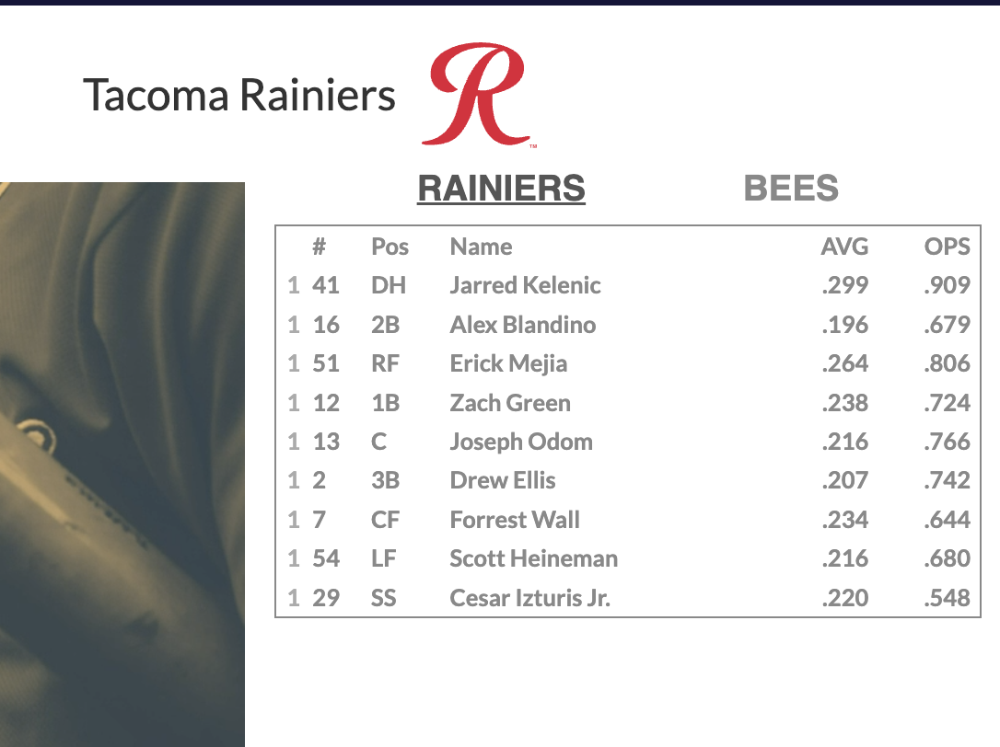

## milb-tv-sidebar

the minor league version of MLB.TV lacks its big brother's sidebar, where useful information like the batting order is presented. the broadcasts themselves aren't much better at providing this kind of info.

this extension aims to fix that, by adding a MLB.TV-like sidebar to the MiLB web player, populated with all sorts of useful information such as batting order, batting/pitching stats on the day or season, and the like.

utilizes svelte for the UI, and the MLB stats API to get data.

---

## roadmap

### provide a simple sidebar that displays the starting batting order for the home and away team

**current status**: ugly, and probably a little broken, but functional. can switch between the teams to show the lineup for both the home and away teams.

### display the game's starting pitchers in the sidebar

### show updates to the lineup such as relief pitchers and pinch hitters/runners

### replicate how MLB.TV shows stats/lineups at the user's playhead
